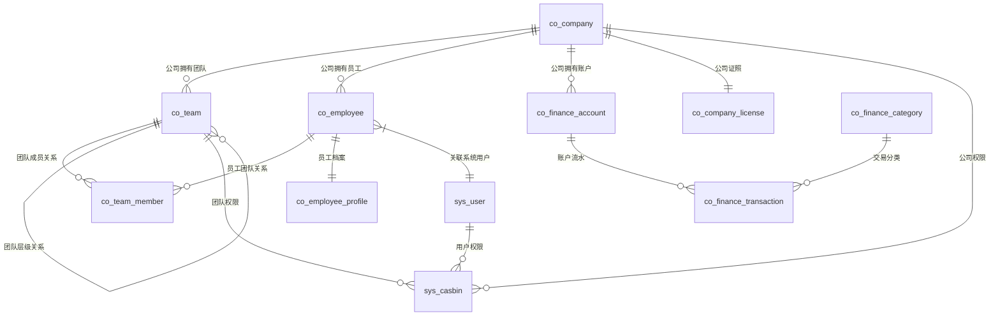

# GF-Admin-Company-Modules 项目技术文档

## 📋 目录
1. [项目概述](#项目概述)
2. [技术架构](#技术架构)
3. [数据库设计](#数据库设计)
4. [API接口设计](#api接口设计)
5. [业务模块设计](#业务模块设计)
6. [多租户架构](#多租户架构)
7. [部署运维](#部署运维)
8. [开发指南](#开发指南)

---

## 🎯 项目概述

### 项目简介
GF-Admin-Company-Modules 是一个专门面向**多机构租户场景**的企业级业务框架，基于 `gf-admin-community` 基础框架构建。该项目提供了完整的多主体业务支持，专注于企业级多租户管理场景，包括公司管理、团队管理、员工管理、财务管理等核心企业业务模块。

### 核心特性
- ✅ **灵活的多主体支持**：支持单租户或多租户架构，可扩展为多主体模式
- ✅ **模块化设计**：支持按需引入各个业务模块，模块间低耦合
- ✅ **企业级特性**：完善的权限控制、多语言国际化、分布式架构
- ✅ **公司管理**：多公司实例管理，独立权限控制
- ✅ **团队管理**：层级化团队结构，灵活的团队协作
- ✅ **员工管理**：完整的员工生命周期管理
- ✅ **财务管理**：企业财务数据管理和统计分析
- ✅ **一键引用**：零逻辑实现业务接口服务
- ✅ **自定义扩展**：支持Hook机制和二次封装

### 技术栈

#### 核心依赖
```go
require (
    github.com/SupenBysz/gf-admin-community v0.11.0  // 基础框架
    github.com/gogf/gf/v2 v2.9.0                     // GoFrame框架
    github.com/kysion/base-library v0.3.6            // 基础库
)
```

#### 技术特点
- **基于 GoFrame 框架**：稳定可靠的Go企业级框架
- **数据库支持**：MySQL、PostgreSQL等主流数据库
- **RESTful API**：完整的API接口设计
- **分布式支持**：支持微服务架构部署
- **权限管理**：基于Casbin的RBAC权限系统
- **国际化支持**：多语言界面支持
- **自动生成**：DAO、API文档自动生成
- **缓存策略**：无侵入式查询缓存，支持Redis分布式缓存
- **Hook系统**：跨进程、跨服务器通信支持

---

## 🏗️ 技术架构

### 整体架构设计

```
┌─────────────────────────────────────────────────────────┐
│                    前端应用层                           │
├─────────────────────────────────────────────────────────┤
│                   API网关层                             │
│  ├─ 版本管理 (v1, v2...)                              │
│  ├─ 路由分发 (co_router)                              │
│  └─ 接口聚合 (多实例支持)                             │
├─────────────────────────────────────────────────────────┤
│                    控制器层                             │
│  ├─ co_controller (企业业务控制器)                    │
│  ├─ 参数验证 & 数据转换                               │
│  ├─ 权限检查 (多实例权限隔离)                         │
│  └─ 响应格式化                                        │
├─────────────────────────────────────────────────────────┤
│                    服务接口层                           │
│  ├─ co_interface (企业业务接口)                       │
│  ├─ ICompany (公司管理接口)                           │
│  ├─ ITeam (团队管理接口)                              │
│  ├─ IEmployee (员工管理接口)                          │
│  └─ IFinance (财务管理接口)                           │
├─────────────────────────────────────────────────────────┤
│                    业务逻辑层                           │
│  ├─ internal/logic (业务实现)                         │
│  ├─ Hook系统 (可扩展业务点)                           │
│  ├─ 多租户逻辑隔离                                     │
│  └─ 跨模块通信                                        │
├─────────────────────────────────────────────────────────┤
│                    数据模型层                           │
│  ├─ co_model (企业数据模型)                           │
│  ├─ co_entity (实体定义)                              │
│  ├─ co_dao (数据访问)                                 │
│  ├─ co_do (领域对象)                                  │
│  └─ co_enum (枚举定义)                                │
├─────────────────────────────────────────────────────────┤
│                   基础设施层                            │
│  ├─ gf-admin-community (基础框架)                     │
│  ├─ 数据库 (PostgreSQL/MySQL)                         │
│  ├─ 缓存 (Redis集群)                                  │
│  ├─ 文件存储 (多云存储)                               │
│  └─ 消息队列 (异步通信)                               │
└─────────────────────────────────────────────────────────┘
```

### 模块化设计架构

#### 1. 多实例支持架构
```go
// 支持多个业务实例
type CompanyModules struct {
    Company  *CompanyInstance  // 公司实例
    Team     *TeamInstance     // 团队实例  
    Employee *EmployeeInstance // 员工实例
    Finance  *FinanceInstance  // 财务实例
}

// 每个实例独立配置
type InstanceConfig struct {
    TablePrefix string                // 数据表前缀
    Permission  *PermissionConfig     // 权限配置
    Cache       *CacheConfig         // 缓存配置
    I18n        *I18nConfig          // 国际化配置
}
```

#### 2. 权限隔离架构
```go
// 多层权限控制
type PermissionLayer struct {
    Global   []Permission  // 全局权限
    Tenant   []Permission  // 租户权限
    Company  []Permission  // 公司权限
    Team     []Permission  // 团队权限
    Employee []Permission  // 员工权限
}
```

### 目录结构详解

```
/
├── api/                      # API接口定义
│   ├── company_api/          # 公司模块API定义
│   ├── team_api/            # 团队模块API定义
│   ├── employee_api/        # 员工模块API定义
│   ├── finance_api/         # 财务模块API定义
│   └── v1/                  # 版本化接口定义
├── base_interface/          # 基础接口定义
├── co_consts/               # 企业常量定义
├── co_controller/           # 企业控制器层
│   ├── company.go           # 公司控制器
│   ├── team.go              # 团队控制器
│   ├── employee.go          # 员工控制器
│   └── finance.go           # 财务控制器
├── co_interface/            # 企业接口层
│   ├── i_controller/        # 控制器接口定义
│   └── service_interface.go # 服务接口聚合
├── co_model/                # 企业数据模型
│   ├── co_dao/              # 数据访问层
│   ├── co_do/               # 领域对象(自动生成)
│   ├── co_entity/           # 实体定义(自动生成)
│   ├── co_enum/             # 枚举定义
│   └── co_hook/             # Hook函数定义
├── co_module/               # 模块操作定义
├── co_permission/           # 权限树定义
├── co_router/               # 路由定义
├── co_service/              # 服务接口定义
├── database/                # 数据库迁移脚本
├── docs/                    # 项目文档
├── example/                 # 使用示例
├── hack/                    # 开发工具
├── internal/                # 内部实现
│   ├── boot/                # 系统引导
│   └── logic/               # 业务逻辑实现
│       ├── company/         # 公司业务逻辑
│       ├── team/            # 团队业务逻辑
│       ├── employee/        # 员工业务逻辑
│       └── finance/         # 财务业务逻辑
├── manifest/                # 配置文件
├── resources/               # 静态资源
├── utility/                 # 工具库
└── company.go               # 模块入口文件
```

---

## 🗄️ 数据库设计

### 企业数据模型设计

#### 核心业务表结构

**公司管理表**
```sql
-- 公司信息表
CREATE TABLE co_company (
    id                BIGINT PRIMARY KEY,
    name              VARCHAR(128) NOT NULL,         -- 公司名称
    legal_name        VARCHAR(256),                  -- 法定名称
    unified_code      VARCHAR(32) UNIQUE,            -- 统一社会信用代码
    legal_person      VARCHAR(64),                   -- 法人代表
    contact_mobile    VARCHAR(32),                   -- 联系电话
    contact_email     VARCHAR(128),                  -- 联系邮箱
    address           TEXT,                          -- 公司地址
    business_scope    TEXT,                          -- 经营范围
    registered_capital DECIMAL(15,2),                -- 注册资本
    establish_date    DATE,                          -- 成立日期
    business_status   INT DEFAULT 1,                 -- 经营状态:1=正常,2=注销,3=吊销
    parent_id         BIGINT DEFAULT 0,              -- 上级公司ID
    union_main_id     BIGINT DEFAULT 0,              -- 租户ID
    state             INT DEFAULT 1,                 -- 状态:1=启用,0=禁用
    -- 审计字段
    created_at        TIMESTAMP DEFAULT CURRENT_TIMESTAMP,
    updated_at        TIMESTAMP DEFAULT CURRENT_TIMESTAMP,
    created_by        BIGINT DEFAULT 0,
    updated_by        BIGINT DEFAULT 0,
    deleted_at        TIMESTAMP NULL,
    deleted_by        BIGINT DEFAULT 0
);

-- 公司认证信息表
CREATE TABLE co_company_license (
    id                BIGINT PRIMARY KEY,
    company_id        BIGINT NOT NULL,               -- 关联公司ID
    license_type      INT DEFAULT 1,                 -- 证照类型:1=营业执照,2=税务登记证
    license_no        VARCHAR(128),                  -- 证照号码
    license_file_id   BIGINT,                       -- 证照文件ID
    issue_date        DATE,                          -- 发证日期
    expire_date       DATE,                          -- 到期日期
    issue_authority   VARCHAR(256),                  -- 发证机关
    verify_status     INT DEFAULT 0,                 -- 验证状态:0=未验证,1=已验证,2=验证失败
    verify_at         TIMESTAMP,                     -- 验证时间
    verify_message    TEXT,                          -- 验证说明
    -- 审计字段
    created_at        TIMESTAMP DEFAULT CURRENT_TIMESTAMP,
    updated_at        TIMESTAMP DEFAULT CURRENT_TIMESTAMP
);
```

**团队管理表**
```sql
-- 团队信息表
CREATE TABLE co_team (
    id                BIGINT PRIMARY KEY,
    company_id        BIGINT NOT NULL,               -- 所属公司ID
    name              VARCHAR(128) NOT NULL,         -- 团队名称
    description       TEXT,                          -- 团队描述
    team_type         INT DEFAULT 1,                 -- 团队类型:1=部门,2=项目组,3=临时团队
    leader_id         BIGINT,                        -- 团队负责人ID
    parent_id         BIGINT DEFAULT 0,              -- 上级团队ID
    sort              INT DEFAULT 0,                 -- 排序
    level             INT DEFAULT 1,                 -- 团队层级
    tree_path         VARCHAR(512),                  -- 团队树路径
    member_count      INT DEFAULT 0,                 -- 成员数量
    state             INT DEFAULT 1,                 -- 状态:1=启用,0=禁用
    -- 审计字段
    created_at        TIMESTAMP DEFAULT CURRENT_TIMESTAMP,
    updated_at        TIMESTAMP DEFAULT CURRENT_TIMESTAMP,
    created_by        BIGINT DEFAULT 0,
    updated_by        BIGINT DEFAULT 0,
    deleted_at        TIMESTAMP NULL,
    deleted_by        BIGINT DEFAULT 0
);

-- 团队成员表
CREATE TABLE co_team_member (
    id                BIGINT PRIMARY KEY,
    team_id           BIGINT NOT NULL,               -- 团队ID
    employee_id       BIGINT NOT NULL,               -- 员工ID
    role_type         INT DEFAULT 1,                 -- 角色类型:1=成员,2=组长,3=经理
    join_date         DATE,                          -- 加入日期
    leave_date        DATE,                          -- 离开日期
    is_leader         BOOLEAN DEFAULT FALSE,         -- 是否负责人
    state             INT DEFAULT 1,                 -- 状态:1=在职,2=离职
    -- 审计字段
    created_at        TIMESTAMP DEFAULT CURRENT_TIMESTAMP,
    updated_at        TIMESTAMP DEFAULT CURRENT_TIMESTAMP,
    
    UNIQUE KEY uk_team_employee (team_id, employee_id)
);
```

**员工管理表**
```sql
-- 员工信息表
CREATE TABLE co_employee (
    id                BIGINT PRIMARY KEY,
    user_id           BIGINT NOT NULL,               -- 关联用户ID(sys_user)
    company_id        BIGINT NOT NULL,               -- 所属公司ID
    employee_no       VARCHAR(64) UNIQUE,            -- 员工编号
    name              VARCHAR(64) NOT NULL,          -- 员工姓名
    avatar            VARCHAR(512),                  -- 头像URL
    gender            INT DEFAULT 0,                 -- 性别:0=未知,1=男,2=女
    birthday          DATE,                          -- 出生日期
    id_card_no        VARCHAR(32),                   -- 身份证号
    mobile            VARCHAR(32),                   -- 手机号
    email             VARCHAR(128),                  -- 邮箱
    address           TEXT,                          -- 地址
    position          VARCHAR(128),                  -- 职位
    job_level         VARCHAR(64),                   -- 职级
    hire_date         DATE,                          -- 入职日期
    contract_start    DATE,                          -- 合同开始日期
    contract_end      DATE,                          -- 合同结束日期
    salary            DECIMAL(10,2),                 -- 基本工资
    work_state        INT DEFAULT 1,                 -- 工作状态:1=在职,2=离职,3=停职
    quit_date         DATE,                          -- 离职日期
    quit_reason       TEXT,                          -- 离职原因
    remark            TEXT,                          -- 备注
    state             INT DEFAULT 1,                 -- 状态:1=启用,0=禁用
    -- 审计字段
    created_at        TIMESTAMP DEFAULT CURRENT_TIMESTAMP,
    updated_at        TIMESTAMP DEFAULT CURRENT_TIMESTAMP,
    created_by        BIGINT DEFAULT 0,
    updated_by        BIGINT DEFAULT 0,
    deleted_at        TIMESTAMP NULL,
    deleted_by        BIGINT DEFAULT 0
);

-- 员工档案表
CREATE TABLE co_employee_profile (
    id                BIGINT PRIMARY KEY,
    employee_id       BIGINT NOT NULL,               -- 员工ID
    education         VARCHAR(32),                   -- 学历
    school            VARCHAR(256),                  -- 毕业院校
    major             VARCHAR(128),                  -- 专业
    graduate_date     DATE,                          -- 毕业时间
    work_experience   TEXT,                          -- 工作经历
    skill_tags        TEXT,                          -- 技能标签(JSON)
    emergency_contact VARCHAR(64),                   -- 紧急联系人
    emergency_mobile  VARCHAR(32),                   -- 紧急联系电话
    bank_name         VARCHAR(128),                  -- 开户银行
    bank_account      VARCHAR(64),                   -- 银行账号
    -- 审计字段
    created_at        TIMESTAMP DEFAULT CURRENT_TIMESTAMP,
    updated_at        TIMESTAMP DEFAULT CURRENT_TIMESTAMP
);
```

**财务管理表**
```sql
-- 财务账户表
CREATE TABLE co_finance_account (
    id                BIGINT PRIMARY KEY,
    company_id        BIGINT NOT NULL,               -- 所属公司ID
    account_name      VARCHAR(128) NOT NULL,         -- 账户名称
    account_type      INT DEFAULT 1,                 -- 账户类型:1=银行账户,2=支付宝,3=微信
    account_no        VARCHAR(128),                  -- 账户号码
    bank_name         VARCHAR(128),                  -- 银行名称
    balance           DECIMAL(15,2) DEFAULT 0,       -- 账户余额
    frozen_balance    DECIMAL(15,2) DEFAULT 0,       -- 冻结余额
    is_default        BOOLEAN DEFAULT FALSE,         -- 是否默认账户
    state             INT DEFAULT 1,                 -- 状态:1=启用,0=禁用
    -- 审计字段
    created_at        TIMESTAMP DEFAULT CURRENT_TIMESTAMP,
    updated_at        TIMESTAMP DEFAULT CURRENT_TIMESTAMP,
    created_by        BIGINT DEFAULT 0,
    updated_by        BIGINT DEFAULT 0
);

-- 财务流水表
CREATE TABLE co_finance_transaction (
    id                BIGINT PRIMARY KEY,
    company_id        BIGINT NOT NULL,               -- 所属公司ID
    account_id        BIGINT NOT NULL,               -- 账户ID
    transaction_no    VARCHAR(128) UNIQUE,           -- 交易流水号
    transaction_type  INT NOT NULL,                  -- 交易类型:1=收入,2=支出,3=转账
    amount            DECIMAL(15,2) NOT NULL,        -- 交易金额
    fee               DECIMAL(15,2) DEFAULT 0,       -- 手续费
    balance_after     DECIMAL(15,2),                 -- 交易后余额
    subject           VARCHAR(256),                  -- 交易主题
    description       TEXT,                          -- 交易描述
    category_id       BIGINT,                        -- 分类ID
    related_id        BIGINT,                        -- 关联业务ID
    related_type      VARCHAR(64),                   -- 关联业务类型
    transaction_date  DATETIME,                      -- 交易时间
    status            INT DEFAULT 1,                 -- 状态:1=成功,2=失败,3=处理中
    -- 审计字段
    created_at        TIMESTAMP DEFAULT CURRENT_TIMESTAMP,
    created_by        BIGINT DEFAULT 0
);

-- 财务分类表
CREATE TABLE co_finance_category (
    id                BIGINT PRIMARY KEY,
    company_id        BIGINT NOT NULL,               -- 所属公司ID
    parent_id         BIGINT DEFAULT 0,              -- 上级分类ID
    name              VARCHAR(128) NOT NULL,         -- 分类名称
    code              VARCHAR(64),                   -- 分类编码
    type              INT DEFAULT 1,                 -- 类型:1=收入,2=支出
    sort              INT DEFAULT 0,                 -- 排序
    state             INT DEFAULT 1,                 -- 状态
    -- 审计字段
    created_at        TIMESTAMP DEFAULT CURRENT_TIMESTAMP,
    updated_at        TIMESTAMP DEFAULT CURRENT_TIMESTAMP
);
```

### 数据关系图



### 索引设计

**核心业务索引**:
```sql
-- 公司相关索引
CREATE INDEX idx_co_company_parent_id ON co_company(parent_id);
CREATE INDEX idx_co_company_union_main_id ON co_company(union_main_id);
CREATE INDEX idx_co_company_unified_code ON co_company(unified_code);

-- 团队相关索引
CREATE INDEX idx_co_team_company_id ON co_team(company_id);
CREATE INDEX idx_co_team_parent_id ON co_team(parent_id);
CREATE INDEX idx_co_team_leader_id ON co_team(leader_id);
CREATE INDEX idx_co_team_member_team_id ON co_team_member(team_id);
CREATE INDEX idx_co_team_member_employee_id ON co_team_member(employee_id);

-- 员工相关索引
CREATE INDEX idx_co_employee_company_id ON co_employee(company_id);
CREATE INDEX idx_co_employee_user_id ON co_employee(user_id);
CREATE INDEX idx_co_employee_employee_no ON co_employee(employee_no);
CREATE INDEX idx_co_employee_work_state ON co_employee(work_state);

-- 财务相关索引
CREATE INDEX idx_co_finance_account_company_id ON co_finance_account(company_id);
CREATE INDEX idx_co_finance_transaction_company_id ON co_finance_transaction(company_id);
CREATE INDEX idx_co_finance_transaction_account_id ON co_finance_transaction(account_id);
CREATE INDEX idx_co_finance_transaction_date ON co_finance_transaction(transaction_date);
CREATE INDEX idx_co_finance_transaction_no ON co_finance_transaction(transaction_no);
```

---

## 🌐 API接口设计

### RESTful API 架构

#### 1. API版本化设计
```
/api/v1/company/     # 公司管理API
/api/v1/team/        # 团队管理API  
/api/v1/employee/    # 员工管理API
/api/v1/finance/     # 财务管理API
```

#### 2. 统一响应格式
```go
// 成功响应
{
    "code": 0,
    "message": "success",
    "data": {
        // 业务数据
    }
}

// 错误响应
{
    "code": 40001,
    "message": "业务错误信息",
    "data": null
}

// 列表响应
{
    "code": 0,
    "data": {
        "records": [...],      // 数据记录
        "total": 100,         // 总记录数
        "page": 1,            // 当前页
        "limit": 10,          // 每页大小
        "pages": 10           // 总页数
    }
}
```

### 核心API模块

#### 公司管理 API

**创建公司**
```http
POST /api/v1/company
Authorization: Bearer {token}
Content-Type: application/json

{
    "name": "科技有限公司",
    "legalName": "XX科技有限公司",
    "unifiedCode": "91110000000000000X",
    "legalPerson": "张三",
    "contactMobile": "13888888888",
    "contactEmail": "contact@company.com",
    "address": "北京市朝阳区XXX",
    "businessScope": "技术开发、技术咨询",
    "registeredCapital": 1000000.00,
    "establishDate": "2020-01-01"
}

Response:
{
    "code": 0,
    "data": {
        "id": 1,
        "name": "科技有限公司",
        "unifiedCode": "91110000000000000X",
        "businessStatus": 1,
        "createdAt": "2024-01-01T10:00:00Z"
    }
}
```

**获取公司列表**
```http
GET /api/v1/company/list?page=1&limit=10&keywords=科技
Authorization: Bearer {token}

Response:
{
    "code": 0,
    "data": {
        "records": [
            {
                "id": 1,
                "name": "科技有限公司",
                "legalName": "XX科技有限公司",
                "unifiedCode": "91110000000000000X",
                "businessStatus": 1,
                "establishDate": "2020-01-01",
                "createdAt": "2024-01-01T10:00:00Z"
            }
        ],
        "total": 1,
        "page": 1,
        "limit": 10
    }
}
```

**公司认证**
```http
POST /api/v1/company/{id}/license
Authorization: Bearer {token}
Content-Type: multipart/form-data

licenseType: 1
licenseFile: [binary]
issueDate: 2020-01-01
expireDate: 2030-01-01
issueAuthority: XX市场监督管理局

Response:
{
    "code": 0,
    "data": {
        "id": 1,
        "companyId": 1,
        "licenseType": 1,
        "licenseNo": "自动识别的证照号码",
        "verifyStatus": 0
    }
}
```

#### 团队管理 API

**创建团队**
```http
POST /api/v1/team
Authorization: Bearer {token}
Content-Type: application/json

{
    "companyId": 1,
    "name": "技术部",
    "description": "负责技术开发工作",
    "teamType": 1,
    "leaderId": 2,
    "parentId": 0
}

Response:
{
    "code": 0,
    "data": {
        "id": 1,
        "companyId": 1,
        "name": "技术部",
        "teamType": 1,
        "level": 1,
        "memberCount": 0
    }
}
```

**获取团队树**
```http
GET /api/v1/team/tree?companyId=1
Authorization: Bearer {token}

Response:
{
    "code": 0,
    "data": [
        {
            "id": 1,
            "name": "技术部",
            "leaderId": 2,
            "memberCount": 5,
            "children": [
                {
                    "id": 2,
                    "name": "前端组",
                    "leaderId": 3,
                    "memberCount": 3,
                    "children": []
                }
            ]
        }
    ]
}
```

**团队成员管理**
```http
POST /api/v1/team/{id}/members
Authorization: Bearer {token}
Content-Type: application/json

{
    "employeeId": 5,
    "roleType": 1,
    "joinDate": "2024-01-01"
}

# 批量添加成员
POST /api/v1/team/{id}/members/batch
{
    "employeeIds": [5, 6, 7],
    "roleType": 1,
    "joinDate": "2024-01-01"
}
```

#### 员工管理 API

**创建员工**
```http
POST /api/v1/employee
Authorization: Bearer {token}
Content-Type: application/json

{
    "companyId": 1,
    "employeeNo": "EMP001",
    "name": "李四",
    "mobile": "13999999999",
    "email": "lisi@company.com",
    "position": "软件工程师",
    "jobLevel": "P6",
    "hireDate": "2024-01-01",
    "salary": 15000.00,
    "profile": {
        "education": "本科",
        "school": "清华大学",
        "major": "计算机科学与技术",
        "emergencyContact": "王五",
        "emergencyMobile": "13777777777"
    }
}

Response:
{
    "code": 0,
    "data": {
        "id": 1,
        "companyId": 1,
        "employeeNo": "EMP001",
        "name": "李四",
        "position": "软件工程师",
        "workState": 1,
        "userId": 10
    }
}
```

**员工入职流程**
```http
POST /api/v1/employee/{id}/onboard
Authorization: Bearer {token}
Content-Type: application/json

{
    "teamId": 1,
    "contractStart": "2024-01-01",
    "contractEnd": "2025-12-31",
    "equipment": ["笔记本电脑", "办公桌椅"],
    "orientation": {
        "mentor": "张三",
        "schedule": ["公司介绍", "岗位培训", "系统权限开通"]
    }
}
```

**员工离职处理**
```http
POST /api/v1/employee/{id}/quit
Authorization: Bearer {token}
Content-Type: application/json

{
    "quitDate": "2024-06-01",
    "quitReason": "个人发展需要",
    "handoverPlan": {
        "handoverTo": 5,
        "handoverItems": ["项目A", "客户B资料"],
        "completionDate": "2024-05-31"
    }
}
```

#### 财务管理 API

**创建财务账户**
```http
POST /api/v1/finance/account
Authorization: Bearer {token}
Content-Type: application/json

{
    "companyId": 1,
    "accountName": "公司基本户",
    "accountType": 1,
    "accountNo": "6226888888888888",
    "bankName": "中国银行",
    "balance": 1000000.00,
    "isDefault": true
}
```

**记录财务交易**
```http
POST /api/v1/finance/transaction
Authorization: Bearer {token}
Content-Type: application/json

{
    "accountId": 1,
    "transactionType": 1,
    "amount": 50000.00,
    "subject": "客户A项目款",
    "description": "XXX项目第一期款项",
    "categoryId": 1,
    "relatedId": 100,
    "relatedType": "contract"
}

Response:
{
    "code": 0,
    "data": {
        "id": 1001,
        "transactionNo": "TXN20240101001",
        "balanceAfter": 1050000.00,
        "status": 1
    }
}
```

**财务报表查询**
```http
GET /api/v1/finance/report?companyId=1&type=monthly&year=2024&month=1
Authorization: Bearer {token}

Response:
{
    "code": 0,
    "data": {
        "period": "2024-01",
        "income": {
            "total": 500000.00,
            "categories": [
                {"name": "项目收入", "amount": 450000.00},
                {"name": "其他收入", "amount": 50000.00}
            ]
        },
        "expense": {
            "total": 200000.00,
            "categories": [
                {"name": "人员工资", "amount": 150000.00},
                {"name": "办公费用", "amount": 50000.00}
            ]
        },
        "profit": 300000.00
    }
}
```

### API安全机制

#### 1. 多层权限验证
```go
// 权限检查中间件
func CompanyPermissionMiddleware(r *ghttp.Request) {
    // 基础用户认证
    user := GetCurrentUser(r.Context())
    if user == nil {
        ResponseUnauthorized(r, "未登录")
        return
    }
    
    // 公司级权限检查
    companyId := r.Get("companyId").Int64()
    if !CheckCompanyAccess(user.Id, companyId) {
        ResponseForbidden(r, "无权限访问此公司")
        return
    }
    
    // 业务级权限检查
    permission := GetRequiredPermission(r.URL.Path, r.Method)
    if !CheckBusinessPermission(user.Id, companyId, permission) {
        ResponseForbidden(r, "无权限执行此操作")
        return
    }
    
    r.Middleware.Next()
}
```

#### 2. 数据权限隔离
```go
// 数据访问控制
func (s *sCompany) GetCompanyList(ctx context.Context, req *co_model.CompanyQueryReq) (*co_model.CompanyListRes, error) {
    user := sys_service.BizCtx().GetUser(ctx)
    
    // 构建查询条件 - 自动添加数据权限过滤
    query := co_dao.CoCompany.Ctx(ctx)
    
    // 超级管理员可查看所有数据
    if !user.IsSuperAdmin() {
        // 普通用户只能查看有权限的公司
        accessibleCompanyIds := s.GetAccessibleCompanyIds(ctx, user.Id)
        query = query.WhereIn(co_dao.CoCompany.Columns().Id, accessibleCompanyIds)
    }
    
    // 租户数据隔离
    if user.UnionMainId > 0 {
        query = query.Where(co_dao.CoCompany.Columns().UnionMainId, user.UnionMainId)
    }
    
    return query.Page(req.Page, req.Limit).All()
}
```

---

## 🔧 业务模块设计

### 公司管理模块

#### 核心功能
- **公司信息管理**：基本信息、法人信息、经营信息
- **公司认证**：营业执照、税务登记证等证照管理
- **公司层级**：支持集团公司、子公司层级管理
- **公司状态**：营业状态、系统状态管理

#### 业务流程

**公司注册流程**
```go
func (s *sCompany) RegisterCompany(ctx context.Context, req *co_model.RegisterCompanyReq) (*co_model.CompanyRes, error) {
    return g.DB().Transaction(ctx, func(ctx context.Context, tx gdb.TX) error {
        // 1. 创建公司基本信息
        company := &co_entity.CoCompany{
            Id:               idgen.NextId(),
            Name:             req.Name,
            LegalName:        req.LegalName,
            UnifiedCode:      req.UnifiedCode,
            LegalPerson:      req.LegalPerson,
            RegisteredCapital: req.RegisteredCapital,
            EstablishDate:    req.EstablishDate,
            BusinessStatus:   co_enum.BusinessStatus.Normal.Code(),
            State:            co_enum.CompanyState.Enable.Code(),
            CreatedAt:        gtime.Now(),
        }
        
        _, err := co_dao.CoCompany.Ctx(ctx).TX(tx).Insert(company)
        if err != nil {
            return err
        }
        
        // 2. 初始化公司权限
        err = s.InitCompanyPermission(ctx, tx, company.Id)
        if err != nil {
            return err
        }
        
        // 3. 创建默认财务账户
        err = s.CreateDefaultFinanceAccount(ctx, tx, company.Id)
        if err != nil {
            return err
        }
        
        // 4. 触发Hook事件
        s.TriggerHook(ctx, co_enum.CompanyEvent.AfterCreate, company)
        
        return nil
    })
}
```

**公司认证流程**
```go
func (s *sCompany) VerifyCompanyLicense(ctx context.Context, req *co_model.VerifyLicenseReq) (*co_model.LicenseRes, error) {
    // 1. OCR识别证照信息
    ocrResult, err := s.OCRService.RecognizeBusinessLicense(ctx, req.LicenseFile)
    if err != nil {
        return nil, err
    }
    
    // 2. 验证证照信息与公司信息一致性
    company, err := co_dao.CoCompany.Ctx(ctx).Where(co_dao.CoCompany.Columns().Id, req.CompanyId).One()
    if err != nil {
        return nil, err
    }
    
    verifyResult := s.ValidateLicenseInfo(company, ocrResult)
    
    // 3. 更新认证状态
    license := &co_entity.CoCompanyLicense{
        CompanyId:    req.CompanyId,
        LicenseType:  req.LicenseType,
        LicenseNo:    ocrResult.LicenseNo,
        VerifyStatus: verifyResult.Status,
        VerifyMessage: verifyResult.Message,
        VerifyAt:     gtime.Now(),
    }
    
    return co_dao.CoCompanyLicense.Ctx(ctx).Insert(license)
}
```

### 团队管理模块

#### 核心功能
- **团队层级管理**：无限层级的部门/团队结构
- **团队成员管理**：成员添加、移除、角色分配
- **团队权限控制**：团队级权限隔离
- **团队协作功能**：团队任务、沟通、文档共享

#### 团队树形结构管理
```go
func (s *sTeam) GetTeamTree(ctx context.Context, companyId int64) ([]*co_model.TeamTreeNode, error) {
    // 1. 获取所有团队数据
    teams, err := co_dao.CoTeam.Ctx(ctx).
        Where(co_dao.CoTeam.Columns().CompanyId, companyId).
        Where(co_dao.CoTeam.Columns().State, co_enum.TeamState.Enable.Code()).
        OrderAsc(co_dao.CoTeam.Columns().Sort).
        All()
    
    if err != nil {
        return nil, err
    }
    
    // 2. 构建树形结构
    teamMap := make(map[int64]*co_model.TeamTreeNode)
    rootTeams := make([]*co_model.TeamTreeNode, 0)
    
    // 转换为节点对象
    for _, team := range teams {
        node := &co_model.TeamTreeNode{
            Team:     team,
            Children: make([]*co_model.TeamTreeNode, 0),
        }
        teamMap[team.Id] = node
    }
    
    // 构建父子关系
    for _, node := range teamMap {
        if node.Team.ParentId == 0 {
            rootTeams = append(rootTeams, node)
        } else {
            parent := teamMap[node.Team.ParentId]
            if parent != nil {
                parent.Children = append(parent.Children, node)
            }
        }
    }
    
    // 3. 加载团队成员信息
    for _, node := range teamMap {
        members, err := s.GetTeamMembers(ctx, node.Team.Id)
        if err == nil {
            node.Members = members
            node.Team.MemberCount = len(members)
        }
    }
    
    return rootTeams, nil
}
```

#### 团队成员管理
```go
func (s *sTeam) ManageTeamMember(ctx context.Context, req *co_model.TeamMemberReq) error {
    return g.DB().Transaction(ctx, func(ctx context.Context, tx gdb.TX) error {
        switch req.Action {
        case "add":
            // 添加成员
            member := &co_entity.CoTeamMember{
                TeamId:     req.TeamId,
                EmployeeId: req.EmployeeId,
                RoleType:   req.RoleType,
                JoinDate:   gtime.Now().Format("Y-m-d"),
                State:      co_enum.MemberState.Active.Code(),
            }
            
            _, err := co_dao.CoTeamMember.Ctx(ctx).TX(tx).Insert(member)
            if err != nil {
                return err
            }
            
            // 更新团队成员数量
            return s.UpdateTeamMemberCount(ctx, tx, req.TeamId, 1)
            
        case "remove":
            // 移除成员
            _, err := co_dao.CoTeamMember.Ctx(ctx).TX(tx).
                Where(co_dao.CoTeamMember.Columns().TeamId, req.TeamId).
                Where(co_dao.CoTeamMember.Columns().EmployeeId, req.EmployeeId).
                Update(g.Map{
                    co_dao.CoTeamMember.Columns().State:     co_enum.MemberState.Left.Code(),
                    co_dao.CoTeamMember.Columns().LeaveDate: gtime.Now().Format("Y-m-d"),
                })
            
            if err != nil {
                return err
            }
            
            // 更新团队成员数量
            return s.UpdateTeamMemberCount(ctx, tx, req.TeamId, -1)
            
        case "transfer":
            // 转移成员
            return s.TransferMember(ctx, tx, req)
        }
        
        return nil
    })
}
```

### 员工管理模块

#### 核心功能
- **员工全生命周期管理**：招聘、入职、在职、离职
- **员工档案管理**：个人信息、教育背景、工作经历
- **员工关系管理**：团队关系、汇报关系、协作关系
- **员工发展管理**：职业发展、培训记录、绩效评估

#### 员工入职流程
```go
func (s *sEmployee) OnboardEmployee(ctx context.Context, req *co_model.OnboardReq) error {
    return g.DB().Transaction(ctx, func(ctx context.Context, tx gdb.TX) error {
        // 1. 创建系统用户账号
        user, err := s.CreateUserAccount(ctx, tx, req)
        if err != nil {
            return err
        }
        
        // 2. 创建员工记录
        employee := &co_entity.CoEmployee{
            Id:          idgen.NextId(),
            UserId:      user.Id,
            CompanyId:   req.CompanyId,
            EmployeeNo:  s.GenerateEmployeeNo(ctx, req.CompanyId),
            Name:        req.Name,
            Mobile:      req.Mobile,
            Email:       req.Email,
            Position:    req.Position,
            JobLevel:    req.JobLevel,
            HireDate:    req.HireDate,
            WorkState:   co_enum.WorkState.Active.Code(),
            State:       co_enum.EmployeeState.Enable.Code(),
            CreatedAt:   gtime.Now(),
        }
        
        _, err = co_dao.CoEmployee.Ctx(ctx).TX(tx).Insert(employee)
        if err != nil {
            return err
        }
        
        // 3. 创建员工档案
        if req.Profile != nil {
            profile := &co_entity.CoEmployeeProfile{
                EmployeeId:       employee.Id,
                Education:        req.Profile.Education,
                School:          req.Profile.School,
                Major:           req.Profile.Major,
                EmergencyContact: req.Profile.EmergencyContact,
                EmergencyMobile:  req.Profile.EmergencyMobile,
            }
            
            _, err = co_dao.CoEmployeeProfile.Ctx(ctx).TX(tx).Insert(profile)
            if err != nil {
                return err
            }
        }
        
        // 4. 分配到团队
        if req.TeamId > 0 {
            err = s.AssignToTeam(ctx, tx, employee.Id, req.TeamId)
            if err != nil {
                return err
            }
        }
        
        // 5. 分配权限和角色
        err = s.AssignPermissions(ctx, tx, user.Id, req.Permissions)
        if err != nil {
            return err
        }
        
        // 6. 触发入职Hook事件
        s.TriggerHook(ctx, co_enum.EmployeeEvent.AfterOnboard, employee)
        
        // 7. 发送入职通知
        go s.SendOnboardNotification(context.Background(), employee)
        
        return nil
    })
}
```

#### 员工离职处理
```go
func (s *sEmployee) QuitEmployee(ctx context.Context, req *co_model.QuitReq) error {
    return g.DB().Transaction(ctx, func(ctx context.Context, tx gdb.TX) error {
        // 1. 更新员工状态
        _, err := co_dao.CoEmployee.Ctx(ctx).TX(tx).
            Where(co_dao.CoEmployee.Columns().Id, req.EmployeeId).
            Update(g.Map{
                co_dao.CoEmployee.Columns().WorkState:   co_enum.WorkState.Left.Code(),
                co_dao.CoEmployee.Columns().QuitDate:    req.QuitDate,
                co_dao.CoEmployee.Columns().QuitReason:  req.QuitReason,
                co_dao.CoEmployee.Columns().UpdatedAt:   gtime.Now(),
            })
        if err != nil {
            return err
        }
        
        // 2. 处理工作交接
        if req.HandoverPlan != nil {
            err = s.ProcessHandover(ctx, tx, req.EmployeeId, req.HandoverPlan)
            if err != nil {
                return err
            }
        }
        
        // 3. 移除团队关系
        err = s.RemoveFromAllTeams(ctx, tx, req.EmployeeId)
        if err != nil {
            return err
        }
        
        // 4. 回收权限
        err = s.RevokeAllPermissions(ctx, tx, req.EmployeeId)
        if err != nil {
            return err
        }
        
        // 5. 禁用系统账号
        err = s.DisableUserAccount(ctx, tx, req.EmployeeId)
        if err != nil {
            return err
        }
        
        // 6. 触发离职Hook事件
        s.TriggerHook(ctx, co_enum.EmployeeEvent.AfterQuit, req)
        
        return nil
    })
}
```

### 财务管理模块

#### 核心功能
- **账户管理**：多账户支持、余额管理、账户状态
- **交易记录**：收支记录、转账记录、流水管理
- **财务分类**：收支分类、成本中心、预算管理
- **财务报表**：收支报表、利润分析、现金流分析

#### 财务交易处理
```go
func (s *sFinance) CreateTransaction(ctx context.Context, req *co_model.CreateTransactionReq) (*co_model.TransactionRes, error) {
    return g.DB().Transaction(ctx, func(ctx context.Context, tx gdb.TX) error {
        // 1. 获取账户信息
        account, err := co_dao.CoFinanceAccount.Ctx(ctx).TX(tx).
            Where(co_dao.CoFinanceAccount.Columns().Id, req.AccountId).
            LockUpdate().
            One()
        if err != nil {
            return err
        }
        
        // 2. 验证余额充足性(支出时)
        if req.TransactionType == co_enum.TransactionType.Expense.Code() {
            if account.Balance < req.Amount {
                return gerror.New("账户余额不足")
            }
        }
        
        // 3. 计算交易后余额
        var balanceAfter decimal.Decimal
        switch req.TransactionType {
        case co_enum.TransactionType.Income.Code():
            balanceAfter = account.Balance.Add(req.Amount)
        case co_enum.TransactionType.Expense.Code():
            balanceAfter = account.Balance.Sub(req.Amount)
        }
        
        // 4. 创建交易记录
        transaction := &co_entity.CoFinanceTransaction{
            Id:              idgen.NextId(),
            CompanyId:       req.CompanyId,
            AccountId:       req.AccountId,
            TransactionNo:   s.GenerateTransactionNo(ctx),
            TransactionType: req.TransactionType,
            Amount:          req.Amount,
            Fee:             req.Fee,
            BalanceAfter:    balanceAfter,
            Subject:         req.Subject,
            Description:     req.Description,
            CategoryId:      req.CategoryId,
            RelatedId:       req.RelatedId,
            RelatedType:     req.RelatedType,
            TransactionDate: gtime.Now(),
            Status:          co_enum.TransactionStatus.Success.Code(),
            CreatedAt:       gtime.Now(),
        }
        
        _, err = co_dao.CoFinanceTransaction.Ctx(ctx).TX(tx).Insert(transaction)
        if err != nil {
            return err
        }
        
        // 5. 更新账户余额
        _, err = co_dao.CoFinanceAccount.Ctx(ctx).TX(tx).
            Where(co_dao.CoFinanceAccount.Columns().Id, req.AccountId).
            Update(g.Map{
                co_dao.CoFinanceAccount.Columns().Balance:   balanceAfter,
                co_dao.CoFinanceAccount.Columns().UpdatedAt: gtime.Now(),
            })
        if err != nil {
            return err
        }
        
        // 6. 触发Hook事件
        s.TriggerHook(ctx, co_enum.FinanceEvent.AfterTransaction, transaction)
        
        return transaction, nil
    })
}
```

#### 财务报表生成
```go
func (s *sFinance) GenerateFinancialReport(ctx context.Context, req *co_model.ReportReq) (*co_model.FinancialReportRes, error) {
    // 1. 构建时间范围
    startDate, endDate := s.BuildDateRange(req.Year, req.Month, req.ReportType)
    
    // 2. 统计收入
    incomeData, err := s.StatisticsIncome(ctx, req.CompanyId, startDate, endDate)
    if err != nil {
        return nil, err
    }
    
    // 3. 统计支出
    expenseData, err := s.StatisticsExpense(ctx, req.CompanyId, startDate, endDate)
    if err != nil {
        return nil, err
    }
    
    // 4. 计算利润
    profit := incomeData.Total.Sub(expenseData.Total)
    
    // 5. 生成现金流数据
    cashFlow, err := s.GenerateCashFlowData(ctx, req.CompanyId, startDate, endDate)
    if err != nil {
        return nil, err
    }
    
    // 6. 组装报表数据
    report := &co_model.FinancialReportRes{
        Period:    fmt.Sprintf("%d-%02d", req.Year, req.Month),
        Income:    incomeData,
        Expense:   expenseData,
        Profit:    profit,
        CashFlow:  cashFlow,
        Charts:    s.GenerateChartData(incomeData, expenseData),
        CreatedAt: gtime.Now(),
    }
    
    // 7. 缓存报表数据
    go s.CacheReport(context.Background(), report)
    
    return report, nil
}
```

---

## 🏢 多租户架构

### 多租户设计模式

#### 1. 数据隔离策略
```go
// 租户数据隔离中间件
func TenantIsolationMiddleware(r *ghttp.Request) {
    user := sys_service.BizCtx().GetUser(r.Context())
    if user == nil {
        return
    }
    
    // 设置租户上下文
    tenantCtx := &TenantContext{
        TenantId:   user.UnionMainId,
        UserId:     user.Id,
        CompanyIds: GetUserAccessibleCompanyIds(r.Context(), user.Id),
    }
    
    // 注入租户上下文
    r.SetCtxVar("tenant", tenantCtx)
    r.Middleware.Next()
}

// 自动添加租户过滤条件
func (s *sCompany) GetCompanyList(ctx context.Context, req *co_model.CompanyQueryReq) (*co_model.CompanyListRes, error) {
    tenant := GetTenantContext(ctx)
    
    query := co_dao.CoCompany.Ctx(ctx).
        Where(co_dao.CoCompany.Columns().UnionMainId, tenant.TenantId)
    
    // 如果不是超级管理员，还需要检查公司级权限
    if !tenant.IsSuperAdmin() {
        query = query.WhereIn(co_dao.CoCompany.Columns().Id, tenant.CompanyIds)
    }
    
    return query.Page(req.Page, req.Limit).All()
}
```

#### 2. 权限分层架构
```
租户级权限 (Tenant Level)
    ↓
公司级权限 (Company Level)  
    ↓
团队级权限 (Team Level)
    ↓
员工级权限 (Employee Level)
```

#### 3. 多实例配置支持
```go
// 支持多个业务实例配置
type CompanyModulesConfig struct {
    Instances map[string]*InstanceConfig `yaml:"instances"`
}

type InstanceConfig struct {
    Name        string                 `yaml:"name"`
    Database    *DatabaseConfig        `yaml:"database"`
    Cache       *CacheConfig          `yaml:"cache"`
    Permissions map[string][]string    `yaml:"permissions"`
    I18n        *I18nConfig           `yaml:"i18n"`
}

// 示例配置
instances:
  company_a:
    name: "科技公司实例"
    database:
      tablePrefix: "coa_"
    permissions:
      admin: ["company:*", "team:*", "employee:*"]
      manager: ["team:read", "employee:read"]
  company_b:  
    name: "贸易公司实例"
    database:
      tablePrefix: "cob_"
    permissions:
      admin: ["company:*", "finance:*"]
```

### 租户数据隔离实现

#### 1. 数据库层隔离
```sql
-- 所有业务表都包含租户字段
ALTER TABLE co_company ADD COLUMN union_main_id BIGINT DEFAULT 0;
ALTER TABLE co_team ADD COLUMN union_main_id BIGINT DEFAULT 0; 
ALTER TABLE co_employee ADD COLUMN union_main_id BIGINT DEFAULT 0;
ALTER TABLE co_finance_account ADD COLUMN union_main_id BIGINT DEFAULT 0;

-- 创建租户隔离索引
CREATE INDEX idx_co_company_union_main_id ON co_company(union_main_id);
CREATE INDEX idx_co_team_union_main_id ON co_team(union_main_id);
CREATE INDEX idx_co_employee_union_main_id ON co_employee(union_main_id);
CREATE INDEX idx_co_finance_account_union_main_id ON co_finance_account(union_main_id);
```

#### 2. 应用层自动过滤
```go
// DAO层自动添加租户过滤
type TenantAwareDAO struct {
    *gdb.Model
    tenantId int64
}

func (dao *TenantAwareDAO) All(where ...interface{}) (gdb.Result, error) {
    return dao.Model.Where("union_main_id", dao.tenantId).Where(where...).All()
}

func (dao *TenantAwareDAO) One(where ...interface{}) (gdb.Record, error) {
    return dao.Model.Where("union_main_id", dao.tenantId).Where(where...).One()
}

// 创建租户感知的DAO
func NewTenantDAO(ctx context.Context, tableName string) *TenantAwareDAO {
    tenant := GetTenantContext(ctx)
    return &TenantAwareDAO{
        Model:    g.DB().Model(tableName),
        tenantId: tenant.TenantId,
    }
}
```

#### 3. 缓存隔离
```go
// 租户级缓存Key策略
func BuildCacheKey(tenantId int64, business string, id interface{}) string {
    return fmt.Sprintf("tenant:%d:%s:%v", tenantId, business, id)
}

// 租户缓存管理器
type TenantCacheManager struct {
    tenantId int64
    redis    *gredis.Redis
}

func (tcm *TenantCacheManager) Set(key string, value interface{}, ttl time.Duration) error {
    tenantKey := BuildCacheKey(tcm.tenantId, key, "")
    return tcm.redis.Set(context.Background(), tenantKey, value, ttl)
}

func (tcm *TenantCacheManager) Get(key string, result interface{}) error {
    tenantKey := BuildCacheKey(tcm.tenantId, key, "")
    return tcm.redis.Get(context.Background(), tenantKey, result)
}
```

---

## 🚀 部署运维

### Docker化部署

#### Dockerfile
```dockerfile
# 多阶段构建
FROM golang:1.24-alpine AS builder

WORKDIR /app
COPY go.mod go.sum ./
RUN go mod download

COPY . .
RUN CGO_ENABLED=0 GOOS=linux go build -a -installsuffix cgo -o company-modules ./example/main.go

# 运行阶段
FROM alpine:latest

RUN apk --no-cache add ca-certificates tzdata
WORKDIR /root/

COPY --from=builder /app/company-modules .
COPY --from=builder /app/manifest ./manifest
COPY --from=builder /app/resources ./resources
COPY --from=builder /app/i18n ./i18n

ENV TZ=Asia/Shanghai

EXPOSE 8080

CMD ["./company-modules"]
```

#### docker-compose.yml
```yaml
version: '3.8'

services:
  company-modules:
    build: .
    ports:
      - "8080:8080"
    depends_on:
      - postgres
      - redis
    environment:
      - DB_HOST=postgres
      - DB_PORT=5432
      - DB_USER=company_user
      - DB_PASSWORD=company_pass
      - DB_NAME=company_modules
      - REDIS_HOST=redis
      - REDIS_PORT=6379
      - REDIS_PASSWORD=redis_pass
    volumes:
      - ./logs:/var/log/company-modules
      - ./uploads:/app/uploads
    networks:
      - company-network

  postgres:
    image: postgres:14
    environment:
      - POSTGRES_DB=company_modules
      - POSTGRES_USER=company_user
      - POSTGRES_PASSWORD=company_pass
    volumes:
      - postgres_data:/var/lib/postgresql/data
      - ./database/latest.sql:/docker-entrypoint-initdb.d/init.sql
    networks:
      - company-network

  redis:
    image: redis:7-alpine
    command: redis-server --requirepass redis_pass
    volumes:
      - redis_data:/data
    networks:
      - company-network

volumes:
  postgres_data:
  redis_data:

networks:
  company-network:
    driver: bridge
```

### Kubernetes部署

#### 部署文件
```yaml
apiVersion: apps/v1
kind: Deployment
metadata:
  name: company-modules
  labels:
    app: company-modules
spec:
  replicas: 3
  selector:
    matchLabels:
      app: company-modules
  template:
    metadata:
      labels:
        app: company-modules
    spec:
      containers:
      - name: company-modules
        image: company-modules:latest
        ports:
        - containerPort: 8080
        env:
        - name: DB_HOST
          value: "postgres-service"
        - name: REDIS_HOST
          value: "redis-service"
        resources:
          requests:
            memory: "512Mi"
            cpu: "500m"
          limits:
            memory: "1Gi" 
            cpu: "1000m"
        livenessProbe:
          httpGet:
            path: /health
            port: 8080
          initialDelaySeconds: 30
          periodSeconds: 10
        readinessProbe:
          httpGet:
            path: /ready
            port: 8080
          initialDelaySeconds: 5
          periodSeconds: 5

---
apiVersion: v1
kind: Service
metadata:
  name: company-modules-service
spec:
  selector:
    app: company-modules
  ports:
  - protocol: TCP
    port: 80
    targetPort: 8080
  type: LoadBalancer
```

---

## 📚 开发指南

### 快速开始

#### 1. 环境准备
```bash
# 安装Go 1.24+
go version

# 安装GoFrame CLI
go install github.com/gogf/gf/cmd/gf/v2@latest

# 克隆项目
git clone https://github.com/SupenBysz/gf-admin-company-modules.git
cd gf-admin-company-modules
```

#### 2. 依赖安装
```bash
# 下载依赖
go mod tidy

# 复制配置文件
cp manifest/config/config.example.yaml manifest/config/config.yaml
```

#### 3. 数据库初始化
```bash
# 创建数据库
createdb company_modules

# 执行初始化脚本
psql -d company_modules -f database/latest.sql
```

#### 4. 启动服务
```bash
# 开发模式
go run example/main.go

# 或使用GoFrame命令
gf run example/main.go
```

### 使用示例

#### 1. 基础引用方式
```go
// main.go
package main

import (
    _ "github.com/SupenBysz/gf-admin-company-modules"
    "github.com/gogf/gf/v2/frame/g"
    "github.com/gogf/gf/v2/net/ghttp"
)

func main() {
    s := g.Server()
    
    // 引用企业模块路由
    s.Group("/api/v1", func(group *ghttp.RouterGroup) {
        // 自动注册所有企业模块路由
        group.Bind(
            co_controller.Company,  // 公司管理
            co_controller.Team,     // 团队管理  
            co_controller.Employee, // 员工管理
            co_controller.Finance,  // 财务管理
        )
    })
    
    s.Run()
}
```

#### 2. 自定义配置使用
```go
// 自定义实例配置
func main() {
    // 配置多个企业实例
    companyConfig := &co_module.CompanyModulesConfig{
        Instances: map[string]*co_module.InstanceConfig{
            "company_tech": {
                Name: "科技公司",
                Database: &co_module.DatabaseConfig{
                    TablePrefix: "tech_",
                },
                Permissions: map[string][]string{
                    "admin": {"company:*", "team:*", "employee:*"},
                },
            },
            "company_trade": {
                Name: "贸易公司", 
                Database: &co_module.DatabaseConfig{
                    TablePrefix: "trade_",
                },
            },
        },
    }
    
    // 初始化模块
    co_module.InitCompanyModules(companyConfig)
    
    s := g.Server()
    s.Run()
}
```

#### 3. Hook扩展使用
```go
// 扩展公司创建Hook
func init() {
    co_service.Company().InstallHook(co_enum.CompanyEvent.AfterCreate, func(ctx context.Context, info co_hook.CompanyHookInfo) co_hook.CompanyHookInfo {
        // 公司创建后自动发送邮件通知
        go SendCompanyCreateNotification(ctx, info.Data.(*co_entity.CoCompany))
        
        // 自动创建默认团队
        go CreateDefaultTeams(ctx, info.Data.(*co_entity.CoCompany))
        
        return info
    })
}

// 扩展员工入职Hook
func init() {
    co_service.Employee().InstallHook(co_enum.EmployeeEvent.AfterOnboard, func(ctx context.Context, info co_hook.EmployeeHookInfo) co_hook.EmployeeHookInfo {
        employee := info.Data.(*co_entity.CoEmployee)
        
        // 发送欢迎邮件
        go SendWelcomeEmail(ctx, employee)
        
        // 创建入职任务
        go CreateOnboardTasks(ctx, employee)
        
        // 分配办公用品
        go AllocateOfficeEquipment(ctx, employee)
        
        return info
    })
}
```

### 自定义开发

#### 1. 扩展业务模块
```go
// 自定义项目管理模块
package co_project

type sProject struct{}

func (s *sProject) CreateProject(ctx context.Context, req *ProjectCreateReq) (*ProjectRes, error) {
    // 实现项目创建逻辑
    project := &CoProject{
        Id:        idgen.NextId(),
        CompanyId: req.CompanyId,
        Name:      req.Name,
        Status:    ProjectStatus.Planning.Code(),
        CreatedAt: gtime.Now(),
    }
    
    _, err := co_dao.CoProject.Ctx(ctx).Insert(project)
    return &ProjectRes{Project: project}, err
}

// 注册自定义服务
func init() {
    co_service.RegisterProject(New())
}
```

#### 2. 自定义权限控制
```go
// 自定义权限验证
func CustomPermissionCheck(ctx context.Context, companyId int64, action string) error {
    user := sys_service.BizCtx().GetUser(ctx)
    
    // 检查用户是否属于该公司
    employee, err := co_service.Employee().GetEmployeeByUserId(ctx, user.Id)
    if err != nil || employee.CompanyId != companyId {
        return gerror.New("无权限访问此公司数据")
    }
    
    // 检查具体业务权限
    hasPermission := co_service.Permission().CheckBusinessPermission(
        ctx, user.Id, companyId, action,
    )
    
    if !hasPermission {
        return gerror.New("权限不足")
    }
    
    return nil
}
```

#### 3. 自定义数据验证
```go
// 自定义验证规则
func init() {
    // 注册公司名称验证规则
    validation.RegisterRule("company_name", func(rule string, value interface{}, message string, data interface{}) error {
        name := gconv.String(value)
        if len(name) < 2 || len(name) > 100 {
            return gerror.New("公司名称长度必须在2-100个字符之间")
        }
        
        // 检查名称是否重复
        count, err := co_dao.CoCompany.Ctx(context.Background()).
            Where(co_dao.CoCompany.Columns().Name, name).
            Count()
        if err == nil && count > 0 {
            return gerror.New("公司名称已存在")
        }
        
        return nil
    })
    
    // 注册员工编号验证规则  
    validation.RegisterRule("employee_no", func(rule string, value interface{}, message string, data interface{}) error {
        employeeNo := gconv.String(value)
        if !regexp.MustCompile(`^[A-Z]{2,3}\d{4,6}$`).MatchString(employeeNo) {
            return gerror.New("员工编号格式不正确")
        }
        return nil
    })
}
```

---

## 📖 总结

GF-Admin-Company-Modules 是一个功能完整、架构清晰的企业级多租户业务框架。通过本文档的详细介绍，开发者可以：

### 🎯 核心价值

1. **快速搭建企业应用**：提供完整的企业业务模块，零代码快速构建
2. **灵活的多租户架构**：支持单租户到多租户的平滑升级
3. **可扩展的模块化设计**：Hook系统和接口化设计便于功能扩展
4. **企业级安全保障**：多层权限控制和数据隔离机制
5. **丰富的业务功能**：公司、团队、员工、财务全业务覆盖

### 🚀 技术优势

- ✅ **现代化架构**：基于GoFrame v2的微服务架构设计
- ✅ **多租户原生支持**：数据隔离、权限隔离、配置隔离
- ✅ **高可扩展性**：Hook机制、接口化设计、模块化架构
- ✅ **企业级特性**：审计日志、权限控制、数据安全
- ✅ **云原生支持**：Docker、Kubernetes部署就绪
- ✅ **开发友好**：完善文档、代码生成、丰富示例

### 📈 适用场景

1. **多公司集团管理**：集团公司下属多个子公司管理
2. **SaaS企业应用**：为多个企业客户提供独立服务
3. **企业内部管理**：大型企业多部门、多团队协作管理
4. **人力资源管理**：员工全生命周期管理系统
5. **财务管理系统**：企业财务数据管理和分析

### 🔧 持续发展

项目基于稳定的`gf-admin-community`基础框架，持续更新维护，支持：

- **功能扩展**：持续增加新的企业业务模块
- **性能优化**：不断优化查询性能和并发处理能力  
- **安全加固**：持续加强安全防护和数据保护
- **生态建设**：与更多第三方服务和工具集成

---

*本文档最后更新时间: 2024年1月*  
*项目版本: v1.0.0*  
*维护团队: SupenBysz开发团队*